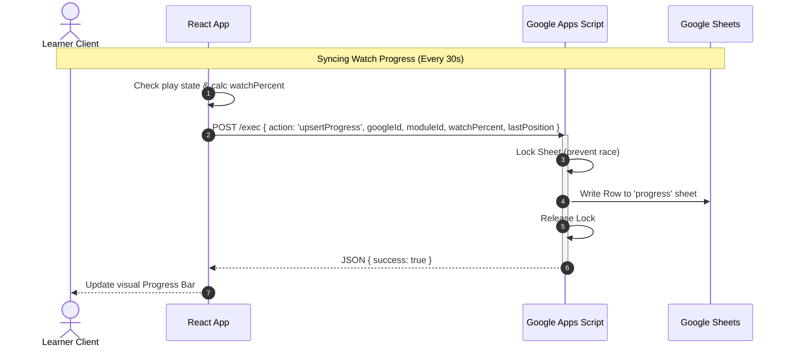

# Architecture Decision Record (ADR)
Version: 1.0 | Status: Proposed | Author: Senior Full-Stack Engineer & Product Architect

This document details the architectural decisions, design choices, data synchronization models, and technology stacks selected for the Digitap Learning Portal.

---

## 1. Hosting: GitHub Pages
*   **Decision**: Deploy the application as a static site hosted on GitHub Pages.
*   **Why**: Zero hosting cost, high availability, simple deployment via GitHub Actions.
*   **Constraint**: Static files only. All backend operations must be outsourced to external client-accessible APIs. No server-side Node.js or Python processes can be run in the deployment workspace.

---

## 2. Frontend Framework: React + Vite
*   **Decision**: Standard React (Single Page Application) built with Vite.
*   **Why**: Components make player overrides, modals, and admin panels easy to build and maintain. Vite provides extremely fast build times, HMR (Hot Module Replacement), and a clean build output (`dist/`) suitable for static hosting.
*   **Styling**: Vanilla CSS alongside Tailwind CSS to enable rich, premium dashboards (using dark mode, glassmorphism, responsive grids, custom transitions) without writing heavy custom stylesheets.

---

## 3. Auth: Client-Side Google OAuth 2.0
*   **Decision**: Use Google OAuth 2.0 implicit client-side flow.
*   **Why**: Completely passwordless. Relies on Digitap's Google Workspace domain. Does not require a database to hold usernames/hashes.
*   **Primary Identifier**: The user's Google unique profile ID (`googleId`).
*   **Admin Designation**: Checked against a hardcoded list of verified email addresses stored in `/src/config/adminEmails.js`.
    ```javascript
    // Example config/adminEmails.js
    export const ADMIN_EMAILS = [
      "admin@digitap.ai",
      "hr@digitap.ai",
      "ecosystem@digitap.ai"
    ];
    ```
*   **Role Logic**: On login, if the user's email is in `ADMIN_EMAILS`, the local profile role is set to `admin`. The App UI handles routes using standard client-side guards:
    *   `AuthGuard`: Blocks unauthenticated users, redirects to `/login`.
    *   `AdminGuard`: Blocks non-admin users, redirects to `/` (homepage).

---

## 4. Backend & Database: Google Sheets + Apps Script
*   **Decision**: Google Sheets serves as the database. Google Apps Script serves as the serverless API backend.
*   **Pattern**:
    1.  A dedicated Google Sheets file is created with tabs: `users`, `progress`, `quizAttempts`, `enrollments`, `content_sections`, `content_modules`, and `content_questions`.
    2.  A Google Apps Script is bound or deployed as a **Web App** with a `doPost(e)` function (accepting HTTP POST).
    3.  The frontend makes fetch calls to the Apps Script Web App URL with a JSON body representing the action and payload.
    4.  The Apps Script processes the action, locks the spreadsheet (to prevent concurrency issues), reads or writes cells, and returns a JSON response.
*   **Web App Endpoint Functions**:
    *   `getUser`: Fetches user profile from `users` sheet.
    *   `upsertUser`: Creates/updates learner records.
    *   `getProgress`: Fetches all progress rows for the user.
    *   `upsertProgress`: Creates/updates watch percentage and completion flags.
    *   `logQuizAttempt`: Records an MCQ attempt.
    *   `getEnrollments`: Lists user-to-batch mappings.
    *   `getSections`: Reads sections metadata.
    *   `getModules`: Reads modules.
    *   `getQuestions`: Reads question banks.
    *   `updateContent`: Admin action to bulk-update modules/questions.

---

## 5. Video Player & Scrubber Control: YouTube IFrame API
*   **Decision**: Embed videos using YouTube's standard iframe player, controlled programmatically via the `window.YT` API.
*   **Scrubber Lock Algorithm**:
    *   Initialize React state: `maxWatchedTime = progress.lastPosition || 0`.
    *   Set a timer running every 250 milliseconds while the video state is `PLAYING`.
    *   In the timer callback:
        *   Get `currentTime = player.getCurrentTime()`.
        *   If `currentTime > maxWatchedTime`:
            *   If `currentTime - maxWatchedTime > 2`: (signaling a seek forward attempt)
                *   Call `player.seekTo(maxWatchedTime, true)`.
            *   Else:
                *   Increment `maxWatchedTime = currentTime`.
    *   The `maxWatchedTime` represents the boundary of watched content. The user can seek back (`seekTo < maxWatchedTime`), but trying to seek past `maxWatchedTime` instantly snaps the video back.

---

## 6. State Management & Contexts
*   **Decision**: Use React Context API split into separate logical contexts to avoid unnecessary re-renders.
*   **AuthContext (`/src/contexts/AuthContext.jsx`)**:
    *   Properties: `user` (profile fields), `isAuthenticated`, `isAdmin`, `loading`.
    *   Methods: `login(token)`, `logout()`.
*   **ProgressContext (`/src/contexts/ProgressContext.jsx`)**:
    *   Properties: `sections` (cached content structure), `userProgress` (map of `moduleId -> progressObj`), `activeModule`.
    *   Methods: `updateWatchProgress(moduleId, seconds, percent)`, `completeModule(moduleId)`.
*   **Storage**: Sync `AuthContext` state to `localStorage` so sessions survive browser refreshes.

---

## 7. Data Synchronization Sequence



---

## 8. Development Secrets Management
*   **Decision**: Store environment-specific values in a `.env` file (gitignored).
*   **Vite Access**: Variables prefixed with `VITE_` are exposed to the client.
    ```env
    # .env.example
    VITE_GOOGLE_CLIENT_ID=your-google-oauth-client-id
    VITE_APPS_SCRIPT_URL=https://script.google.com/macros/s/your-deployment-id/exec
    ```
*   A template `.env.example` is committed to git. Developers copy this to `.env` locally.
